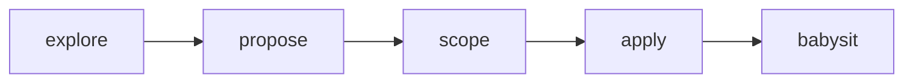

# Oliver

Personal agent skill suite — workflows Cole uses across projects.

## OliverSpec

Linear-backed explore → propose → scope → apply → babysit (OpenSpec-shaped, without repo-local change artifacts).

| Skill | Role |
|-------|------|
| [`oliverspec-explore`](./oliverspec-explore/SKILL.md) | Think through a problem (no implementation) |
| [`oliverspec-propose`](./oliverspec-propose/SKILL.md) | Write product **PRD** + deeply technical **TRD** as Linear docs |
| [`oliverspec-scope`](./oliverspec-scope/SKILL.md) | Break PRD/TRD into Linear tickets with ACs + `blockedBy` |
| [`oliverspec-apply`](./oliverspec-apply/SKILL.md) | Implement via parallel sub-agents; one Graphite-stacked PR per ticket |
| [`oliverspec-babysit`](./oliverspec-babysit/SKILL.md) | Clear PR comments + CI across the stack (ignores Graphite mergeability) |



### Install (Cursor)

Symlink into your personal skills directory:

```bash
git clone git@github.com:chroline/oliver.git ~/oliver-skills
for s in oliverspec-explore oliverspec-propose oliverspec-scope oliverspec-apply oliverspec-babysit; do
  ln -sfn ~/oliver-skills/$s ~/.cursor/skills/$s
done
```

Or copy the folders into a project’s `.cursor/skills/` / `.agents/skills/`.

### Requirements

- [Linear MCP](https://linear.app) (propose / scope / apply / babysit)
- [Graphite CLI](https://graphite.dev) `gt` (apply / babysit stacks)
- GitHub CLI `gh` (PR inspection in babysit)
