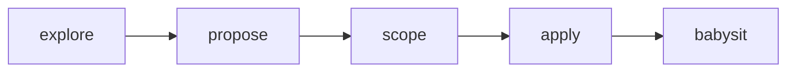

# Oliver

Personal agent skill suite — workflows Cole uses across projects.

Install via the [skills](https://github.com/vercel-labs/skills) CLI (listed on [skills.sh](https://skills.sh) after install telemetry):

```bash
npx skills add chroline/oliver
# or install everything non-interactively:
npx skills add chroline/oliver --all -y
```

Browse: https://skills.sh/chroline/oliver

## OliverSpec

Linear-backed explore → propose → scope → apply → babysit (OpenSpec-shaped, without repo-local change artifacts).

| Skill | Role |
|-------|------|
| [`oliverspec-explore`](./skills/oliverspec-explore/SKILL.md) | Think through a problem (no implementation) |
| [`oliverspec-propose`](./skills/oliverspec-propose/SKILL.md) | Write product **PRD** + deeply technical **TRD** as Linear docs |
| [`oliverspec-scope`](./skills/oliverspec-scope/SKILL.md) | Break PRD/TRD into Linear tickets with ACs + `blockedBy` |
| [`oliverspec-apply`](./skills/oliverspec-apply/SKILL.md) | Implement via parallel sub-agents; one Graphite-stacked PR per ticket |
| [`oliverspec-babysit`](./skills/oliverspec-babysit/SKILL.md) | Clear PR comments + CI across the stack (ignores Graphite mergeability) |



### Requirements

- [Linear MCP](https://linear.app) (propose / scope / apply / babysit)
- [Graphite CLI](https://graphite.dev) `gt` (apply / babysit stacks)
- GitHub CLI `gh` (PR inspection in babysit)
