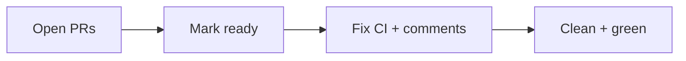

# Babysit

Standalone skill: watch open GitHub PRs (single, chain, or `gh stack`) until **real CI is green** and review threads are clean. Marks drafts **ready** before watching. Does **not** merge.

Use alone (`/babysit`) or as the watch phase inside [Factory](../factory/README.md).



## Install

```bash
npx skills add chroline/oliver/skills/babysit
```

## What it does

1. Resolves a PR set (numbers, stack, Linear issue, or branches)
2. Ensures every PR is **ready** (not draft) before watching CI
3. Loops: snapshot → fix comments/CI (per-PR worktrees) → wait for real CI
4. Ignores stack merge-readiness / merge-queue gates
5. Stops when the set is clean + green — **no merge**

## What you need

- **GitHub CLI (`gh`) 2.90.0+** with `gh extension install github/gh-stack` (for stacks)
- Optional: **Linear MCP** when resolving by issue ID

## Related

- Single-ticket pipeline that calls this after opening PRs: [Factory](../factory/README.md) (vendored installs may use `chroline-factory`)
- Project-wide babysit for OliverSpec: [oliverspec-babysit](../oliverspec/oliverspec-babysit/SKILL.md) (same folder name when vendored alongside OliverSpec skills)
