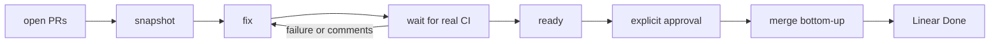

# Babysit

Standalone skill for taking the open PRs for **one Linear ticket** through CI, review fixes, explicit approval, and merge.



## Install

```bash
npx skills add chroline/oliver/skills/babysit
```

## What it does

1. Finds all open PR layers tied to one Linear ticket
2. Repeatedly snapshots real CI and unresolved review threads
3. Fixes failures and actionable comments in the correct PR layer
4. Propagates lower-layer fixes up the GitHub stack
5. Ignores stack-only merge-readiness gates and queue position
6. Stops when mergeable and asks for your explicit approval
7. Re-checks, merges bottom-up, and moves the Linear issue to Done

Factory invokes this skill after it opens PRs, but you can also run `/babysit <ISSUE-ID>` directly for an existing ticket.

## What you need

- **Linear MCP**
- **GitHub CLI (`gh`) 2.90.0+**
- Optional `github/gh-stack` extension; chained plain PRs are supported as a fallback

## Related

- Single-ticket planning and implementation: [Factory](../factory/README.md)
- Full project workflow: [OliverSpec](../oliverspec/README.md)
