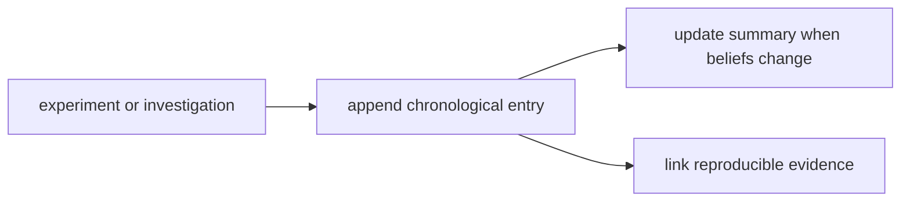

# Lab Notebook

Standalone skill for preserving experiments, debugging, and operational investigations in one Markdown file.



## Install

```bash
npx skills add chroline/oliver/skills/lab-notebook
```

## What it does

1. Reuses the project's existing Markdown notebook convention or creates `lab-notebook.md`
2. Keeps current understanding and live hypotheses in a concise summary
3. Appends one structured entry per meaningful intervention
4. Never edits, reorders, or deletes prior chronological entries
5. Preserves exact evidence, negative results, confidence, and decision impact

No external service is required.
