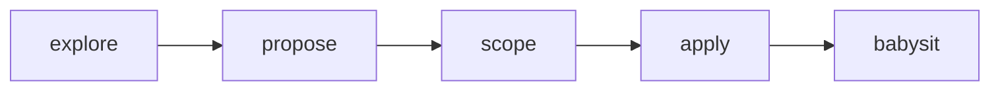

# OliverSpec

Run Linear-backed changes the way I do: explore, propose, scope, apply, then babysit. OliverSpec mirrors [OpenSpec](https://openspec.dev/)’s shape without writing proposal files into the git repo.

I keep the plan in Linear (project, documents, tickets) and ship work as [GitHub stacked pull requests](https://docs.github.com/en/pull-requests/get-started/stacked-prs-quickstart), one PR per ticket.



## Install OliverSpec

Install the full OliverSpec suite with:

```bash
npx skills add chroline/oliver/skills/oliverspec
```

OliverSpec is one suite inside [Oliver](../../). Browse it on [skills.sh/chroline/oliver](https://skills.sh/chroline/oliver).

## Skills in the suite

Each skill covers one stage of the workflow:

| Skill | What it does |
|-------|----------------|
| [`oliverspec-explore`](./oliverspec-explore/SKILL.md) | Think through the problem. Read code, draw diagrams, challenge assumptions. No implementation. No Linear writes unless you ask to capture. |
| [`oliverspec-propose`](./oliverspec-propose/SKILL.md) | Create or update a Linear project with a product PRD and a deeply technical TRD. Does not create tickets. |
| [`oliverspec-scope`](./oliverspec-scope/SKILL.md) | Turn the PRD and TRD into Linear tickets with acceptance criteria (including comprehensive TDD test expectations) and explicit `blockedBy` / `blocks` relations. |
| [`oliverspec-apply`](./oliverspec-apply/SKILL.md) | Implement the project in one session via TDD (failing tests + typecheck-clean stubs, then implement backwards). Fan out parallel sub-agents (1 ticket → 1 agent → 1 worktree), mark tickets In Progress, open one stacked PR per ticket. |
| [`oliverspec-babysit`](./oliverspec-babysit/SKILL.md) | Clear open PR comments and CI failures across the stack. Wait for real CI. Ignore stack merge-readiness gates. |

## How I write the PRD and TRD

I keep product and engineering voices separate so each doc stays useful:

| Doc | Voice | Put here | Keep out |
|-----|-------|----------|----------|
| **PRD** | Product | Problem, users, outcomes, UX behavior, success metrics | Schemas, APIs, file paths, infra choices |
| **TRD** | Deeply technical | Architecture, data model, APIs, control flow, failure modes, rollout | Soft product copy, goals with no mechanism |

## Defaults I expect

These are the defaults unless you override them:

| Setting | Default |
|---------|---------|
| Linear team | Engineering |
| Persistence | Linear only. No `openspec/changes/` (or similar) in the repo |
| Branch names | The Linear issue git branch name from `get_issue` |
| PRs | GitHub stacks: agents open PRs with `gh pr create --base <parent>`, the parent links them with `gh stack link`, one PR per ticket |
| Apply parallelism | Parallel `Task` sub-agents for every ready ticket in a wave, each in its own git worktree outside the repo |
| `gh stack` calls | Parent agent only, serially, from the main checkout — never from a sub-agent |
| Implementation style | TDD: failing tests + typecheck-clean stubs first, then implement backwards to green |

## What you need installed

OliverSpec depends on these tools:

- **Linear MCP**: propose, scope, apply, and babysit ([Linear](https://linear.app))
- **GitHub CLI (`gh`) 2.90.0 or later**: PRs, CI inspection, and stacks ([GitHub CLI](https://cli.github.com))
- **`gh stack` extension**: apply and babysit stacks — `gh extension install github/gh-stack` ([docs](https://docs.github.com/en/pull-requests/reference/stacked-prs-cli-commands)). Stacked pull requests are in public preview and must be enabled for the repository

## Run a change end to end

Work the stages in order:

1. **Explore** until the problem and approach are clear
2. **Propose**: confirm the PRD and TRD, then write them to Linear
3. **Scope**: confirm the ticket breakdown and Mermaid dependency graph, then create issues and wire relations
4. **Apply**: let parallel agents open the stack
5. **Babysit**: clear comments and get real CI green across the stack
