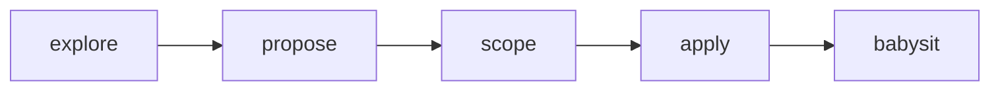

# OliverSpec

My Linear-backed change workflow — OpenSpec-shaped (`explore` → `propose` → `scope` → `apply` → `babysit`), without dumping proposal artifacts into the git repo.

I keep the plan in **Linear** (project + documents + tickets) and ship implementation as **Graphite-stacked PRs**, one per ticket.



## Install

```bash
npx skills add chroline/oliver/skills/oliverspec
```

This is part of my [Oliver](../../) skill suite. Browse on [skills.sh](https://skills.sh/chroline/oliver).

## Skills

| Skill | What I use it for |
|-------|-------------------|
| [`oliverspec-explore`](./oliverspec-explore/SKILL.md) | Think through a problem — read code, diagram, challenge assumptions. No implementation, no Linear writes unless I ask to capture. |
| [`oliverspec-propose`](./oliverspec-propose/SKILL.md) | Create/update a Linear project with a **PRD** (product voice) and a detailed **TRD** (deeply technical voice). No tickets yet. |
| [`oliverspec-scope`](./oliverspec-scope/SKILL.md) | Break the PRD/TRD into Linear tickets with acceptance criteria and explicit `blockedBy` / `blocks` relations. |
| [`oliverspec-apply`](./oliverspec-apply/SKILL.md) | Implement the whole project in one go — parallel sub-agents (1 ticket → 1 agent), mark tickets In Progress, one Graphite-stacked PR per ticket. |
| [`oliverspec-babysit`](./oliverspec-babysit/SKILL.md) | Loop across the stack: fix PR comments + CI failures, wait for real CI. I ignore Graphite mergeability on purpose. |

## Document voices

I keep these voices strict so the docs stay useful:

| Doc | Perspective | I put here | I keep out |
|-----|-------------|------------|------------|
| **PRD** | Product | Problem, users, outcomes, UX/behavior, success metrics | Schemas, APIs, file paths, infra choices |
| **TRD** | Deeply technical | Architecture, data model, APIs, control flow, failure modes, rollout | Soft product copy, vague goals without a mechanism |

## Defaults

| Setting | What I default to |
|---------|-------------------|
| Linear team | Engineering (unless I say otherwise) |
| Persistence | Linear only — no `openspec/changes/` (or similar) in the repo |
| Branch names | The Linear issue’s git branch name from `get_issue` |
| PRs | Graphite stacks (`gt create` / `gt submit`) — one PR per ticket |
| Apply parallelism | Fan out parallel `Task` sub-agents per ready wave |

## Requirements

- [Linear MCP](https://linear.app) — propose / scope / apply / babysit
- [Graphite CLI](https://graphite.dev) `gt` — apply / babysit stacks
- [GitHub CLI](https://cli.github.com) `gh` — babysit PR/CI inspection

## Typical flow

1. **Explore** until I’m clear on the problem and approach  
2. **Propose** → confirm PRD + TRD → write them to Linear  
3. **Scope** → confirm ticket breakdown + Mermaid deps → create issues + wire relations  
4. **Apply** → parallel agents open the Graphite stack  
5. **Babysit** → comments + CI green across the stack  
